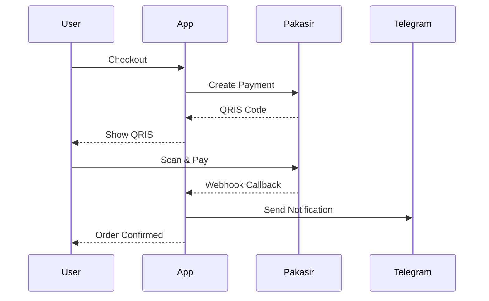

<div align="center">

<!-- Animated Logo/Banner -->


<!-- Animated Badges -->
<p>
  
  
  
  
  
</p>

<!-- Animated Status Badges -->
<p>
  
  
  
</p>

<!-- Animated Divider -->


</div>

<!-- Typing Animation Introduction -->
<p align="center">
  <a href="https://git.io/typing-svg">
    
  </a>
</p>

<!-- Table of Contents with Animated Icons -->
##  Daftar Isi

- [ Fitur Utama](#-fitur-utama)
- [ Teknologi](#-teknologi)
- [ Demo Langsung](#-demo-langsung)
- [ Screenshots](#-screenshots)
- [ Instalasi](#-instalasi)
- [ Dokumentasi](#-dokumentasi)
- [ API & Integrasi](#-api--integrasi)
- [ Kontribusi](#-kontribusi)
- [ Lisensi](#-lisensi)

<!-- Animated Divider -->


##  Fitur Utama

<div align="center">

<!-- Feature Cards with Animations -->
<table>
<tr>
<td width="50%">

###  Autentikasi Multi-Provider

<p>
 Google OAuth<br>
 GitHub OAuth<br>
 Facebook OAuth<br>
 Email/Password
</p>

</td>
<td width="50%">

###  E-Commerce Lengkap

<p>
 Keranjang Belanja<br>
 Multi-tier Pricing<br>
 QRIS Payment<br>
 Riwayat Pesanan
</p>

</td>
</tr>
<tr>
<td width="50%">

###  Kimi AI Assistant

<p>
 Chat 24/7<br>
 Rekomendasi Produk<br>
 Jawaban Cepat<br>
 Streaming Response
</p>

</td>
<td width="50%">

###  Notifikasi Real-time

<p>
 Telegram Bot<br>
 Email (EmailJS)<br>
 Toast Notifications<br>
 Status Update
</p>

</td>
</tr>
</table>

</div>

<!-- Animated Stats -->
<p align="center">
  
  
  
</p>

<!-- Animated Divider -->


##  Teknologi

<div align="center">

<!-- Tech Stack with Animated Icons -->
<table>
<tr>
<td align="center" width="96">

<br>React 18
</td>
<td align="center" width="96">

<br>TypeScript
</td>
<td align="center" width="96">

<br>JavaScript
</td>
<td align="center" width="96">

<br>Vite
</td>
<td align="center" width="96">

<br>Tailwind
</td>
<td align="center" width="96">

<br>Supabase
</td>
</tr>
<tr>
<td align="center" width="96">

<br>Vercel
</td>
<td align="center" width="96">

<br>Git
</td>
<td align="center" width="96">

<br>Node.js
</td>
<td align="center" width="96">

<br>NPM
</td>
<td align="center" width="96">

<br>VS Code
</td>
<td align="center" width="96">

<br>Figma
</td>
</tr>
</table>

<!-- Particle Animation -->


</div>

###  Library & Dependencies

```
📦 UI Components
├── @radix-ui/* - Headless UI components
├── shadcn/ui - Modern UI component library
├── framer-motion - Animation library
├── lucide-react - Icon library

📦 State Management
├── zustand - State management
├── zustand/persist - Persistence

📦 Backend & Auth
├── @supabase/supabase-js - Backend & Authentication
├── @supabase/auth-ui-react - Auth UI components

📦 Payment & Services
├── axios - HTTP client
├── emailjs-com - Email service

📦 Utilities
├── clsx - Conditional classes
├── tailwind-merge - Merge Tailwind classes
├── date-fns - Date formatting
├── sonner - Toast notifications
```

<!-- Animated Divider -->


##  Demo Langsung

<div align="center">

<!-- Animated Live Demo Button -->
<a href="https://web1-two-nu.vercel.app/">
  
</a>

<br><br>

<!-- QR Code for Mobile Access -->
<p>
  
  <br>
  <sub>Scan untuk akses via mobile</sub>
</p>

<!-- Test Credentials -->
<details>
<summary> Test Credentials</summary>

<br>

| Role | Email | Password |
|------|-------|----------|
| Demo User | `demo@example.com` | `demo123456` |

**Atau login dengan:**
-  Google OAuth
-  GitHub OAuth
-  Facebook OAuth

</details>

</div>

<!-- Animated Divider -->


##  Screenshots

<div align="center">

<!-- Screenshot Gallery with Animation -->
<table>
<tr>
<td>

<br>
<p align="center"><strong>Homepage dengan Dark Mode</strong></p>
</td>
<td>

<br>
<p align="center"><strong>Keranjang Belanja</strong></p>
</td>
</tr>
<tr>
<td>

<br>
<p align="center"><strong>Kimi AI Assistant</strong></p>
</td>
<td>

<br>
<p align="center"><strong>User Profile & Orders</strong></p>
</td>
</tr>
</table>

<!-- Animated GIF Showcase -->
<p>
  
</p>

</div>

<!-- Animated Divider -->


##  Instalasi

###  Clone Repository

```bash
# Clone repository
git clone https://github.com/username/layanan-digital.git

# Masuk ke folder project
cd layanan-digital

# Install dependencies
npm install
```

###  Environment Setup

```bash
# Copy environment file
cp .env.example .env

# Edit file .env dengan editor favorit
nano .env
```

**Isi file .env:**

<details>
<summary> Klik untuk lihat template .env</summary>

```env
# ============================================
# WEBSITE CONFIGURATION
# ============================================
VITE_SITE_NAME=Layanan Digital
VITE_SITE_DESCRIPTION="Solusi Digital untuk Kebutuhan Anda"
VITE_SITE_URL=https://web1-two-nu.vercel.app
VITE_SITE_LOGO_URL=https://files.catbox.moe/dlsf6y.svg

# Owner Information
VITE_OWNER_NAME=Fakhul
VITE_OWNER_EMAIL=fakhulrohman2@gmail.com
VITE_OWNER_PHONE=085183518016

# ============================================
# SUPABASE CONFIGURATION
# ============================================
VITE_SUPABASE_URL=https://ojwbrhxdencqqrexezhe.supabase.co
VITE_SUPABASE_ANON_KEY=your_supabase_anon_key

# ============================================
# EMAILJS CONFIGURATION
# ============================================
VITE_EMAILJS_SERVICE_ID=your_service_id
VITE_EMAILJS_WELCOME_TEMPLATE_ID=your_template_id
VITE_EMAILJS_PUBLIC_KEY=your_public_key

# ============================================
# TELEGRAM BOT
# ============================================
VITE_TELEGRAM_BOT_TOKEN=your_bot_token
VITE_TELEGRAM_CHAT_ID=your_chat_id

# ============================================
# PAYMENT GATEWAY (PAKASIR)
# ============================================
VITE_PAKASIR_SLUG=your_merchant_slug
VITE_PAKASIR_API_KEY=your_api_key

# ============================================
# KIMI AI
# ============================================
VITE_KIMI_API_KEY=your_kimi_api_key
VITE_KIMI_MODEL=kimi-for-coding
```

</details>

###  Run Development Server

```bash
# Start development server
npm run dev

# Server akan berjalan di http://localhost:5173
```

###  Build for Production

```bash
# Build untuk production
npm run build

# Preview production build
npm run preview

# Deploy ke Vercel
vercel --prod
```

<!-- Animated Divider -->


##  Dokumentasi

###  Dokumentasi Lengkap

| Dokumen | Deskripsi | Link |
|---------|-----------|------|
|  Setup Manual | Panduan setup ultra detail | [`SETUP_MANUAL.md`](./SETUP_MANUAL.md) |
|  Error Logs | Daftar error & solusi | [`ERROR_LOGS.md`](./ERROR_LOGS.md) |
|  Security Fixes | SQL fixes untuk Supabase | [`supabase-security-fixes.sql`](./supabase-security-fixes.sql) |
|  Supabase Setup | Dokumentasi Supabase | [`SUPABASE_SETUP.md`](./SUPABASE_SETUP.md) |
|  EmailJS Setup | Dokumentasi EmailJS | [`EMAILJS_SETUP.md`](./EMAILJS_SETUP.md) |

###  Struktur Project

```
📦 layanan-digital/
├── 📁 .github/              # GitHub workflows
├── 📁 .vscode/              # VS Code settings
├── 📁 assets/               # Static assets
│   ├── 📁 media/            # Banner images (b1.webp - b5.webp)
│   └── favicon.ico
├── 📁 dist/                 # Build output
├── 📁 src/
│   ├── 📁 components/       # React components
│   │   ├── ui/              # UI components (shadcn)
│   │   ├── Header.tsx
│   │   ├── ProductModalUltra.tsx
│   │   └── WelcomeModalUltra.tsx
│   ├── 📁 hooks/            # Custom React hooks
│   │   ├── useAuth.ts
│   │   ├── useCart.ts
│   │   ├── usePayment.ts
│   │   └── useSupport.ts
│   ├── 📁 lib/              # Utilities & services
│   │   ├── supabase.ts
│   │   ├── supabase-auth.ts
│   │   ├── telegram.ts
│   │   ├── emailjs.ts
│   │   ├── kimi-ai.ts
│   │   └── pakasir.ts
│   ├── 📁 sections/         # Page sections
│   │   ├── HomeSection.tsx
│   │   ├── CartSection.tsx
│   │   ├── AuthSection.tsx
│   │   ├── ProfileSectionUltra.tsx
│   │   └── SupportSectionUltra.tsx
│   ├── 📁 store/            # Zustand store
│   │   └── appStore.ts
│   ├── AdminApp.tsx         # Admin dashboard
│   ├── App.tsx              # Main App
│   └── main.tsx             # Entry point
├── 📄 .env                  # Environment variables
├── 📄 package.json
├── 📄 tailwind.config.js
├── 📄 tsconfig.json
└── 📄 vite.config.ts
```

<!-- Animated Divider -->


##  API & Integrasi

###  Supabase Endpoints

| Service | Endpoint | Method | Description |
|---------|----------|--------|-------------|
| Auth | `/auth/v1/token` | POST | OAuth callback |
| Auth | `/auth/v1/user` | GET | Get current user |
| DB | `/rest/v1/products` | GET | List products |
| DB | `/rest/v1/orders` | POST | Create order |
| DB | `/rest/v1/support_tickets` | POST | Create ticket |

###  Payment Flow



<!-- Animated Divider -->


##  Kontribusi

<div align="center">

<!-- Contribution Stats -->


<br><br>

Kontribusi selalu diterima! Silakan baca [`CONTRIBUTING.md`](./CONTRIBUTING.md) untuk panduan kontribusi.

<!-- Contribution Guidelines -->
<table>
<tr>
<td width="33%" align="center">

<br>
<strong>Ide & Feature</strong>
<br>
Buka issue dengan label `enhancement`
</td>
<td width="33%" align="center">

<br>
<strong>Bug Report</strong>
<br>
Buka issue dengan label `bug`
</td>
<td width="33%" align="center">

<br>
<strong>Pull Request</strong>
<br>
Fork, fix, dan submit PR
</td>
</tr>
</table>

</div>

<!-- Animated Divider -->


##  Lisensi

<div align="center">

<!-- License Badge -->


<br><br>

**[MIT License](LICENSE)** © 2026 Fakhul

Dibuat dengan  oleh Tim Layanan Digital

<br>

<!-- Social Links -->
<a href="https://instagram.com/fatkulxc">
  
</a>
<a href="https://wa.me/6285183518016">
  
</a>
<a href="mailto:fakhulrohman2@gmail.com">
  
</a>

</div>

<!-- Animated Footer -->


<!-- Hidden visitor counter -->
<p align="center">
  
</p>
